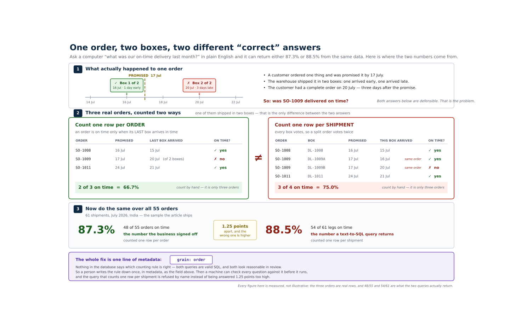

# Building a Semantic Layer for Natural-Language Querying

**A step-by-step implementation guide, with a runnable reference implementation.**

This project answers one question: *what has to be true before you can trust a
natural-language answer to a business question?*

It walks eight build phases (P0–P7). Each phase emits one real metadata artifact,
and each artifact closes one specific way natural-language querying fails. Nothing
here is illustrative — every file in `metadata/` is parsed by the code, every figure
in this guide is computed from the committed CSVs, and every claim is asserted by a
test.

The domain is SAP **Plan-to-Deliver**: manufacturing through delivery. Manufacturing
phases are what make *"why"* answerable, which is the difference between a layer that
reports and a layer that explains.

## The architectural rule

Everything below follows from one decision, so it is worth stating before anything else:

> **The model picks which governed metric a question means. It never writes SQL and
> never computes arithmetic.**

A model asked to write SQL can produce a query that runs, returns a plausible number,
and is quietly wrong — the wrong date column, a join that fans out, a cohort nobody
agreed to. A model asked only to *select from a governed list* can be wrong in exactly
one way: it picks the wrong item. And that failure is visible, because a validator
checks the selection against the semantic model **before any SQL exists**.

So the pipeline is: natural language → a validated `QueryIntent` → a deterministic
compiler. The metadata artifacts are what make the middle step checkable.

---

## Contents

1. [The problem: the wrong answer is the believable one](#1-the-problem)
2. [Quickstart](#2-quickstart-no-api-key-needed)
3. [The domain: Plan-to-Deliver](#3-the-domain-plan-to-deliver)
4. [The eight build phases](#4-the-eight-build-phases)
5. [How metadata answers a question](#5-how-metadata-answers-a-question)
6. [What this does not do](#6-what-this-does-not-do)
7. [Appendix](#7-appendix)

---

## 1. The problem

Two questions an executive actually asks:

> **Q1.** "On-time delivery for India warehouses last month"
> **Q2.** "Why did on-time delivery drop for India warehouses last month?"

Point a competent text-to-SQL system at a clean SAP-derived warehouse and ask Q1. It
joins the order table to the delivery table — reasonable, the delivery table is where
delivery dates live — and computes:

```
54 on-time delivery rows / 61 delivery rows = 88.52%
```

The correct answer is **87.3%** (48 of 55 orders). The error is **1.25 percentage
points**, and it is in the *flattering* direction.

That combination is the whole problem. The wrong answer is not absurd. It does not
trigger anyone's disbelief. It is close enough to pass review, close enough to put in
a board deck, and *higher* than the truth — so nobody goes looking. It survives
precisely because it is plausible.

### Where the 1.25pp comes from

Six of the 55 eligible India/July orders shipped in **two legs** — partial shipment,
entirely normal SAP behaviour. Measured at delivery-leg grain the row count becomes 61:

| | On time | Denominator | OTD |
|---|---|---|---|
| Grain-correct (**order** grain) | 48 | 55 | **87.27%** |
| Naive (**delivery** grain) | 54 | 61 | **88.52%** |

`SO-1009` is the row that shows why it matters: leg A arrived on time, leg B arrived
late. At delivery grain that is one success and one failure. At order grain it is a
single **late** order — the order is not delivered until the last leg lands. The naive
count credits it with a success it did not earn.



*The same disagreement without the vocabulary: one order, two boxes, two defensible
counting rules, and three orders counted by hand. (Also available as
[`docs/diagrams/grain_two_ways.png`](docs/diagrams/grain_two_ways.png). Generated by
`docs/diagrams/render_grain.py`; every figure in it — including the hand count — is
recomputed from the built warehouse by `tests/test_diagram.py`, so the simplified version
cannot drift from the real one.)*

Worse, the bias direction depends on the data. A fully on-time split order pulls the
naive figure *up*; a fully late one pulls it *down*. So the error is not even a
consistent offset you could learn to correct for.

The same trap appears in first-pass yield, via exclusions rather than grain. Write the
query without the governed exclusions and you get 52/55 = **94.55%** instead of the
correct 51/54 = **94.4%**. Two separate slips, each worth one row:

- `SO-1004`'s inspection lot `QL-4004` was reworked and *eventually* accepted. Reading
  the final decision instead of the first counts it as a first-pass success, taking the
  numerator from 51 to 52.
- `PO-3007` was cancelled and never inspected, so dropping that exclusion leaves it in
  the denominator: 54 to 55.

Both errors push the same way. Again overstating, again by an amount small enough to
look like rounding.

**Grain mistakes do not announce themselves with absurd values. They move the number
by roughly the amount people argue about in review meetings.** Eyeballing the output
will not catch this. A validator that checks declared grain will.

And Q2 — *why* — is not answerable at all without process metadata. There is no
column called "reason". The cause has to be *derived* from manufacturing phase
timestamps, which is what Phase 4 exists to make possible.

---

## 2. Quickstart (no API key needed)

```bash
pip install -r requirements.txt
python src/build_warehouse.py
python src/ask.py --offline Q1
python src/ask.py --offline Q2
python -m pytest
```

No `ANTHROPIC_API_KEY` is required for any of this. The resolver — the one component
that calls a model — is bypassed in offline mode by hand-authored **golden intents**
in `tests/golden_intents.json`. Every other stage runs for real: real validation, real
SQL compilation, real DuckDB execution, real data-quality rules, real provenance.

That is deliberate. A guide whose examples you cannot reproduce is a guide you have to
take on faith.

`python src/ask.py --offline Q1` prints:

```
QUESTION "On-time delivery for India warehouses last month"

ANSWER   On-Time Delivery % is 87.3% -- 48 of 55 eligible orders delivered on or before the promised date

  metric        on_time_delivery_pct -- Share of eligible customer orders delivered on or before the promised delivery date. An order counts as delivered only when its final leg arrives.
  arithmetic    48 / 55 = 87.2727%
  grain         order (one row per order)
  window        July 2026 (2026-07-01 to 2026-07-31) on promised_delivery_date
  filters       region = IN
  exclusions    cancelled_orders, not_yet_due
  lineage       SAP SD -> SAP EWM -> SAP TM -> fact_order_delivery
  trust         TRUSTED
  gates         7/7 passed: dimensions_declared, exclusions_applied, filters_bound, grain_matches, metric_approved, no_fanout, time_window_bounded
```

Every line after `ANSWER` is provenance, and all of it is derived rather than
asserted: the arithmetic is the numerator and denominator the SQL actually returned,
the exclusions are the ones the compiler actually applied, and the trust badge is the
outcome of the data-quality rules that actually ran.

`--offline Q2` adds the diagnostic half:

```
  BREAKDOWN
    Quality inspection           4
    Transportation               2
    Production execution         1
    unattributed                 0

  Largest contributor: Quality inspection (4 of 7 late orders).

  COMPARISON
    prior window               June 2026 (2026-06-01 to 2026-06-30) on promised_delivery_date
    prior value                96.2% (25 / 26)
    change                     down 8.9pp (96.2% -> 87.3%)
```

Other flags: `--list` shows the stored questions, `--context` prints the exact
metadata slice the resolver is given, and `--sql` prints the compiled SQL alongside
the answer. With credentials configured, pass a question in quotes instead of
`--offline` and the resolver maps it for you.

### Or without cloning anything

The same architecture also ships as a single file with the data and metadata embedded,
for reading in one sitting or pasting into a terminal:

```bash
pip install duckdb pyyaml
python standalone/semantic_layer_demo.py
```

It builds its own in-memory warehouse and prints the governed answer, the wrong answer
the same rows yield, that wrong query refused by name, the per-phase diagnostic, and
four more classes of refused question. One metric instead of three and no separate
artifact files — otherwise the same seven gates and the same compiler.
`tests/test_standalone.py` checks its numbers against this project's, so the short
version cannot quietly disagree with the long one.

---

## 3. The domain: Plan-to-Deliver

An order is late because *something in the chain took longer than it was supposed to*.
To attribute that, you need the chain itself as metadata: which phases exist, which
system records each one, which timestamp marks it, and how long it is supposed to take.

Twelve phases, from `metadata/04_process_model.yml`:

| # | Phase | Module | Business event | Timestamp | Std. days |
|---|---|---|---|---|---|
| 1 | Demand & order capture | SAP SD | Sales order created | `VBAK-ERDAT` | 0 |
| 2 | Requirements planning | **SAP PP** (MRP) | Planned order created | `PLAF-PSTTR` | 1 |
| 3 | Production order release | **SAP PP** | Production order released | `AFKO-GSTRP` | 1 |
| 4 | Material staging & issue | **SAP MM** | Goods issue to production | `MSEG-BUDAT` | 1 |
| 5 | Production execution | **SAP PP** | Operation confirmed | `AFRU-BUDAT` | 3 |
| 6 | Quality inspection | **SAP QM** | Usage decision | `QALS-VDATUM` | 1 |
| 7 | Goods receipt to stock | **SAP MM** / EWM | GR to unrestricted stock | `MKPF-BUDAT` | 1 |
| 8 | Picking & packing | SAP EWM | Picking completed | `picking_date` | 1 |
| 9 | Goods issue / dispatch | SAP LE-SHP | Actual goods issue | `LIKP-WADAT_IST` | 0 |
| 10 | Transportation | SAP TM | Shipment dispatched | `VTTK-DPTBG` | 3 |
| 11 | Delivery confirmation | SAP TM / LE | POD received | `final_delivery_date` | 0 |
| 12 | Billing | SAP SD | Invoice created | `VBRK-FKDAT` | 1 |

Phases 1–11 sum to **12 days**: the delivery promise horizon. Billing follows delivery
and cannot consume promise slack, so it is excluded from the slack computation.

### The attribution rule

For each order and each phase: `variance_days = actual_duration − standard_duration`.
The attributed cause is `argmax(variance_days)`, ties broken to the earliest phase.

Two conventions in that sentence are load-bearing:

**Spans are end-anchored.** A span belongs to the phase it *ends at*. Naming a
variance after the phase it starts from puts every standard one phase out of step —
which is exactly the defect that shipped in an early version of the fact table and had
to be corrected.

**Spans are contiguous.** Each starts where the previous ended, so every day between
`order_date` and `final_delivery_date` is owned by exactly one phase, and
`sum(variances) = elapsed − 12` for every delivered order. An unowned span would let a
real delay produce no variance anywhere — the pipeline would return "no cause found"
for an order that was demonstrably late. The warehouse build asserts this
reconciliation directly.

Nine of the twelve phases are attributable (`phase_seq` 2–10). Phase 1 is the chain's
start point rather than a span, phase 11 is a zero-day POD event folded into the
transportation span, and phase 12 comes after delivery. Declaring the other three as
possible values would let a filter pass the gates and return **zero rows dressed as an
answer**.

Here is the whole Q2 answer, hand-checkable, straight from the fact table — the seven
late India/July orders and their variances:

| Order | Promised | Delivered | var_confirm | var_qm | var_shipment | Attributed to |
|---|---|---|---|---|---|---|
| `SO-1002` | 2026-07-13 | 2026-07-16 | 0 | **+4** | −1 | quality_inspection |
| `SO-1003` | 2026-07-14 | 2026-07-19 | 0 | 0 | **+5** | transportation |
| `SO-1004` | 2026-07-14 | 2026-07-18 | 0 | **+5** | −1 | quality_inspection |
| `SO-1005` | 2026-07-15 | 2026-07-18 | **+4** | 0 | −1 | production_execution |
| `SO-1006` | 2026-07-15 | 2026-07-19 | 0 | **+5** | −1 | quality_inspection |
| `SO-1009` | 2026-07-17 | 2026-07-20 | 0 | 0 | **+3** | transportation |
| `SO-1010` | 2026-07-18 | 2026-07-22 | 0 | **+5** | −1 | quality_inspection |

Four to quality inspection, two to transportation, one to production execution. Notice
that transportation ran *under* standard on five of the seven — the layer discriminates
rather than always blaming the last visible step, which is the failure mode of
attribution built on "whatever was late at the end".

### The dataset

132 orders: 20 hand-authored in `data/seed_core.csv` (every defect, every late order,
the full manufacturing event chain for each) plus 112 well-behaved orders from
`data/generate.py`, seeded at `random.Random(20260807)` with no wall-clock and no
network, so re-running it leaves the CSVs byte-identical.

| Segment | Orders | Cancelled | Eligible | On time | Late | OTD |
|---|---|---|---|---|---|---|
| IN — July 2026 (**Q1, Q2**) | 56 | 1 | 55 | 48 | 7 | **87.27%** |
| IN — June 2026 (comparison) | 27 | 1 | 26 | 25 | 1 | **96.15%** |
| IN — August 2026 | 4 | 0 | 0 (not yet due) | — | — | n/a |
| US — July 2026 | 30 | 2 | 28 | 26 | 2 | 92.86% |
| US — June 2026 | 15 | 0 | 15 | 14 | 1 | 93.33% |

The size is not arbitrary: 87.3% is impossible with six orders — each order would move
the number 16.7pp. Percentages have to be believable to be worth reasoning about.

Eight deliberate defects are seeded, each teaching exactly one lesson: a cancelled
order (`SO-1007`), an in-transit null promised into the future (`SO-1013`), a rework
loop (`SO-1004`), six split deliveries, a re-promised date (`SO-1011`), a make-to-stock
order with no production order (`SO-1015`), QM-dominated delays, and delays attributed
elsewhere.

---

## 4. The eight build phases

Every phase below follows the same shape: **INPUT → WORK → OUTPUT → GATE → NL FAILURE
CLOSED**. The gate is how you know the phase is done. The last line is the point of
doing it at all.

### Phase 0 — Scope and KPI contract

**INPUT:** the questions the business actually asks.
**WORK:** agree the metric definitions, owners, stewards, and what "done" means, in
writing, before touching data.
**OUTPUT:** `metadata/00_kpi_contract.md`.

```markdown
| Metric | Definition | Grain | Owner | Steward |
| **On-Time Delivery %** | Share of eligible customer orders delivered on or
  before the promised delivery date | `order` | VP Supply Chain | Supply Chain
  Analytics Lead |
```

The contract also settles what "last month" means, which is not obvious. The governed
reading is **`promised_delivery_date` within the month** — the promise is what the
customer was told and what the metric is judged against. Reading it as the *delivery*
date instead selects a different cohort and returns a different number, and both
readings are defensible until someone writes one of them down.

**GATE:** every metric has a named owner, a grain, and an exclusion list; the two
demonstrator questions have expected answers with arithmetic.

**NL FAILURE CLOSED:** building a semantic layer with no acceptance test for "done".
Without this file, "on-time delivery" means whatever the query author assumed, and two
people asking the same question get two different numbers — with neither able to show
the other is wrong.

### Phase 1 — Technical metadata harvest

**INPUT:** the source system's data dictionary (SAP DDIC via SE11/SE16).
**WORK:** extract tables, fields, data elements, domains, keys, nullability, source
module.
**OUTPUT:** `metadata/01_technical_metadata.json` — 20 fields across VBAK, VBEP, AFKO,
AFRU, QALS, MSEG, MKPF, LIKP, VTTK, VBRK.

```json
{
  "table": "LIKP", "field": "WADAT_IST", "data_element": "WADAT_IST",
  "data_type": "DATS", "length": 8, "is_nullable": true,
  "source_system": "SAP LE-SHP",
  "description": "Actual Goods Movement Date",
  "target_column": "goods_issue_date"
}
```

**GATE:** every field carries a `target_column`, so the mapping to the warehouse is
declared rather than inferred from name similarity.

**NL FAILURE CLOSED:** there is nothing to bind business terms *to*. "When did it
ship" cannot resolve to `LIKP-WADAT_IST` if nothing records that `WADAT_IST` is the
actual goods-movement date and that it is nullable. A model guessing among
`WADAT`, `WADAT_IST` and `LFDAT` will guess plausibly and wrongly.

### Phase 2 — Standardize and declare grain

**INPUT:** Phase 1's field inventory and the raw extracts.
**WORK:** canonical names, real types, conformed dimensions — and **declare the grain
of every table**.
**OUTPUT:** `sql/02_staging_model.sql` plus `metadata/02_standardized_metadata.json`.

```json
{
  "table": "fact_order_delivery",
  "grain": "order",
  "primary_key": "order_id",
  "row_count": 132, "unique_keys": 132,
  "why_this_grain_matters": "6 orders ship in two legs. Measuring OTD at
    delivery-leg grain double-counts split shipments and produces 88.52%
    instead of 87.27%."
}
```

The grain declaration is the single highest-value line of metadata in this project. It
is what turns §1's 88.52% from an opinion into a rule violation.

**GATE:** `count(*) = count(DISTINCT primary_key)` for each declared grain — 132
orders over 132 distinct `order_id`, 131 production orders over 131 distinct
`production_order_id`. A test asserts it against the built warehouse, so any future
fan-out fails the build rather than the board deck.

**NL FAILURE CLOSED:** `VBELN` vs `vbeln` vs `sales_doc` — the model cannot tell they
are one thing. And with no declared grain, no downstream component can tell that
joining to delivery legs is an error rather than a choice.

### Phase 3 — Business glossary and column bindings

**INPUT:** Phase 2's canonical columns and the vocabulary people actually use.
**WORK:** define each business term, list its **synonyms** and allowed values, and bind
each term to a physical column.
**OUTPUT:** `metadata/03_glossary.yml` and `metadata/03_column_bindings.yml`.

```yaml
- term: On-Time Delivery %
  synonyms: [OTD, on time delivery, delivery performance, delivery reliability,
             promise adherence, OTIF, on time in full]
  owner: VP Supply Chain
  calculation: (delivered_on_time / eligible_orders) * 100
```

```yaml
- term: Region
  table: fact_order_delivery
  column: region
  scope: business
```

The `scope` field is a governance decision, not bookkeeping. `business`-scoped
bindings are named in the glossary and offered to the resolver; `internal` ones —
variance columns, flags, raw phase timestamps — are deliberately withheld. Exposing 27
more terms widens the guess space without answering a question anyone asks. A test
enforces that every business-scoped binding has a glossary entry, so this stays a
decision rather than drift.

**GATE:** every bound column exists in the warehouse (checked against
`PRAGMA table_info()`), and every business-scoped term is defined in the glossary.

**NL FAILURE CLOSED:** "OTD for India last month" is unresolvable. No metric in
`05_semantic_model.yml` carries a `synonyms` key — "OTD" is a dead end without the
glossary. And nothing can validate that "India" is a legal region value rather than a
typo that will silently return zero rows.

### Phase 4 — Business process and event lineage

**INPUT:** the process as the business runs it, and Phase 1's timestamp fields.
**WORK:** model the twelve phases, bind each to its system, event and timestamp, set
standard durations, and define the variance attribution rule.
**OUTPUT:** `metadata/04_process_model.yml`.

```yaml
- phase_seq: 6
  phase_key: quality_inspection
  phase_name: Quality inspection
  sap_module: SAP QM
  business_event: Usage decision
  timestamp_field: qm_final_decision_date
  standard_duration_days: 1
```

```yaml
- column: var_qm
  phase_key: quality_inspection
  span: prod_confirm_date -> qm_final_decision_date
  standard_duration_days: 1
  note: >
    Uses the FINAL decision, because attribution asks how long inspection
    actually took including any rework re-inspection. first_pass_yield_pct is
    the opposite case and must use the FIRST decision.
```

That note is the subtlety worth stealing. The *same* inspection process feeds two
metrics that need **opposite** readings of it: attribution asks how long inspection
took (final decision), first-pass yield asks whether it passed the first time (first
decision). One timestamp column cannot serve both, and picking either one silently
breaks the other metric.

**GATE:** the nine variance standards sum to 12 — the same 12 that
`available_slack_days` subtracts — and `sum(variances) = elapsed − 12` for every
delivered order. Standard durations are compared row by row against
`dim_process_phase` in the SQL, so the YAML and the warehouse cannot disagree.

**NL FAILURE CLOSED:** the layer answers *what* and never *why*. Q2 is not a harder
version of Q1; without process metadata it is an unanswerable question, because "cause"
is not a column anywhere in SAP. This file is what turns it into arithmetic over
timestamps.

### Phase 5 — Semantic model and metrics

**INPUT:** everything above.
**WORK:** declare entities, joins **with cardinality**, dimensions with allowed values,
and metrics with grain, expression, exclusions and approval state.
**OUTPUT:** `metadata/05_semantic_model.yml` — the single definition of every metric,
read by both BI and NL querying so the number cannot drift between a dashboard and a
chat answer.

```yaml
- name: on_time_delivery_pct
  label: On-Time Delivery %
  entity: fact_order_delivery
  grain: order
  time_dimension: promised_delivery_date
  expression:
    type: ratio_percent
    numerator: "sum(CASE WHEN is_on_time THEN 1 ELSE 0 END)"
    denominator: "sum(CASE WHEN is_eligible THEN 1 ELSE 0 END)"
  exclusions:
    - key: cancelled_orders
      predicate: "order_status <> 'CANC'"
      rationale: A cancelled order was never due; including it inflates the denominator.
    - key: not_yet_due
      predicate: "promised_delivery_date <= DATE '__AS_OF_DATE__'"
      rationale: >
        An order promised after the as-of date is not late, it is pending.
  approval_state: approved
```

Two things here do more work than they look like they do.

**Join cardinality is declared, not discovered.**

```yaml
joins:
  - to: fact_production_order
    cardinality: many_to_one      # PERMITTED -- 131 production orders, 131 distinct orders
  - to: raw_deliveries
    cardinality: one_to_many      # REFUSED -- 6 orders ship in two legs
    note: FAN-OUT HAZARD ... yields 88.52% instead of 87.27%.
```

Both edges are needed. `many_to_one` is required — `fact_production_order` carries no
region and no promised date, so both manufacturing metrics are unfilterable without it.
`one_to_many` is the hazard. A gate that refused all joins would be useless; a gate
that refused none would produce §1's wrong answer. The distinction has to be in the
metadata because it cannot be inferred from the query.

**`approval_state` is what makes refusal possible.** The contract defines four metrics;
three are approved and implemented. The fourth, `production_cycle_time_days`, is
**deferred**: it is a plain average over columns the other three already materialize,
so it teaches nothing new for the cost of building it. Asking for it produces a
refusal, not an approximation — which is the correct behaviour for a metric with an
agreed definition and no implementation.

**GATE:** every metric has a grain matching its entity, an explicit exclusion list, a
named owner, and an approval state. Every dimension resolves to a real column. The
compiler asserts 87.27% / 88.52% / 94.4% / 94.55% / 92.6% from the built warehouse, so
the narrative in §1 is under test rather than retold.

**NL FAILURE CLOSED:** the model invents arithmetic. Without a governed expression it
writes its own `SUM`/`COUNT` — and gets 88.52% by joining to delivery legs, or 94.55%
by counting rework as first-pass success. With one, the arithmetic is fixed and the
model's only job is choosing which fixed arithmetic to run.

### Phase 6 — Quality contract

**INPUT:** the metrics and the columns they read.
**WORK:** write rules bound to **specific metric inputs**, each with a threshold and a
severity.
**OUTPUT:** `metadata/06_dq_rules.yml` — six rules across six DQ dimensions.

| Rule | Dimension | Severity | Bound to | Catches |
|---|---|---|---|---|
| `dq_completeness_delivery_date` | completeness | degrading | OTD numerator | missing delivery dates among past-due orders |
| `dq_validity_enum_values` | validity | **blocking** | all three metrics | status/plant outside declared allowed values |
| `dq_uniqueness_order_grain` | uniqueness | **blocking** | OTD | the split-delivery fan-out — the 88.52% defect |
| `dq_timeliness_warehouse_freshness` | timeliness | degrading | all three metrics | a stale mart answering as if current |
| `dq_consistency_phase_ordering` | consistency | **blocking** | OTD, adherence | phase timestamps out of order, invalidating attribution |
| `dq_accuracy_otd_certification` | accuracy | **blocking** | OTD | recomputed OTD drifting >0.1pp from the certified figure |

Binding rules to metric inputs rather than to tables is what makes the result usable. A
failing rule degrades **a specific answer**, not a dashboard-wide red light that
everyone learns to ignore.

Each answer carries a badge: `TRUSTED`, `DEGRADED (rule X failing)`, or `BLOCKED`. The
badge gates *presentation* — a `BLOCKED` input returns a refusal **instead of** the
number, not the number with a warning beside it. A caveat next to a figure loses to the
figure every time; someone will screenshot the number and drop the caveat.

**GATE:** each of the eight seeded defects trips its intended rule, and each rule stays
quiet on the others. Verified by corrupting a scratch copy of the warehouse inside a
rolled-back transaction, one defect at a time, and asserting the whole verdict set.
There is exactly one expected cross-fire: a duplicated order row trips
`dq_uniqueness_order_grain` *and* `dq_accuracy_otd_certification`, because it genuinely
changes the published number. That is the certification working as a backstop, not
leakage.

**NL FAILURE CLOSED:** confidently wrong answers from incomplete inputs. A pipeline
with perfect metadata and stale data still produces a number, and without a trust
badge the answer looks identical to a good one.

### Phase 7 — Publish, resolve, and defend

**INPUT:** everything above.
**WORK:** publish the metric as a catalog asset with lineage and governance fields, and
wire the query path.
**OUTPUT:** `metadata/07_catalog_asset.json` plus the runnable pipeline.

```json
{
  "asset_id": "semantic.metric.on_time_delivery_pct",
  "asset_type": "certified_metric",
  "certification_state": "certified",
  "data_subject_category": "business_customer_contact",
  "personal_data_category": "limited_personal_data",
  "processing_purpose": "Supply chain performance measurement",
  "legal_basis": "legitimate_interest_contract_performance",
  "retention_period": "P7Y",
  "lineage": ["SAP SD (VBAK/VBAP) — sales order created", "..."]
}
```

**These governance fields make personal data discoverable and support India DPDP
readiness work. They do not enforce anything.** Enforcement lives in access control,
consent management, retention automation, and masking at the platform layer. A catalog
entry claiming `retention_period: P7Y` does not delete anything on schedule, and
treating it as if it does is worse than having no field at all — it converts an open
question into a false answer.

The `personal_data_fields` block is where that honesty gets specific: `customer_id` is
classified as a pseudonymous identifier with the note that it "resolves to a legal
entity in SAP KNA1; for named-individual sole proprietors it is personal data under
DPDP." That is a real edge case, recorded rather than smoothed over.

**GATE:** the published asset's `definition_sql` matches the semantic model's
expression, its lineage chain reaches from SAP tables to the consumer, and its
`quality_contract` names the rules that actually exist in `06_dq_rules.yml`.

**NL FAILURE CLOSED:** an answer with no provenance is an answer you cannot defend in a
review. "The system said 87.3%" is not a claim anyone can act on. "87.3% = 48/55
eligible India orders promised in July, at order grain, excluding cancelled and
not-yet-due, from `fact_order_delivery` via SAP SD → EWM → TM, all seven gates passed,
six DQ rules green" is.

---

### Where each of the nine artifacts actually comes from

Eight phases produced nine files. The question that always lands next, usually from
whoever is being asked to fund the work, is *"can't we just harvest this from SAP?"*


*(Also available as
[`docs/diagrams/metadata_sources.png`](docs/diagrams/metadata_sources.png). Generated
from a declared graph by `docs/diagrams/render_sources.py`; every arrow carries a `probe`
string that must occur in the artifact it points at, so a provenance claim the file
itself does not support fails the suite instead of shipping.)*

The answer is **one of the nine**. `01_technical_metadata.json` comes out of the SAP data
dictionary via SE11 / SE16, repeatably and cheaply. The other eight split into:

- **DERIVED (4)** — computed from earlier artifacts plus the data. `02` from `01` plus the
  raw rows plus staging SQL; `03_column_bindings.yml` from the glossary checked against
  real warehouse columns; `05` from P2's grain, P3's words and P4's phases; `07` from
  `05` + `06` plus governance fields. Cheap to keep current, because every input is
  itself a versioned artifact.
- **AUTHORED (4)** — decided by a person with a name. What "on-time" means (P0), which
  synonyms are sanctioned (P3 glossary), what a standard QM usage decision takes (P4),
  what completeness threshold is tolerable (P6).

That split is the planning fact worth carrying away, because it predicts where the
calendar goes. A crawler gets you tables, fields, domains and types. It cannot get you
grain, exclusions, an approved definition, or a standard duration — and those are exactly
the fields that decide whether the answer is *right* rather than merely well-formed. The
88.5% error lives in a field no harvester produces.

The right-hand band of the figure carries the other half: **when** each artifact is
consumed. P0 is never read at runtime at all — it is the oracle the answer is judged
against. P1 and P2 are consumed once, at build time. Only P3–P7 are read per question,
which is the handoff into the next section.

---

## 5. How metadata answers a question

Six stages. Exactly one calls a model.


*(Also available as [`docs/diagrams/nl_dataflow.png`](docs/diagrams/nl_dataflow.png).
The figure is generated from a declared graph by `docs/diagrams/render_dataflow.py`;
`--check` fails if it drifts from the code, and its edges are tested against the module
sources so the picture cannot claim a read the code does not make.)*

### Build time vs query time

The distinction the diagram exists to make: **P1 and P2 artifacts are consumed at
build time**, by `sql/02_staging_model.sql` and the warehouse build. They are not
inputs to a question. **P3–P7 artifacts are consumed at query time**, per question.

So the SAP data dictionary is not a live dependency of every query — which is both the
truth and considerably less alarming than the alternative reading.

### Which stage reads which artifact

| Stage | Reads | What it supplies |
|---|---|---|
| **1. Retriever** | `03_glossary.yml` | synonyms — "OTD", "OTIF" → the metric |
| | `03_column_bindings.yml` | business terms → physical columns |
| | `04_process_model.yml` | the twelve phases, marked attributable or not |
| | `05_semantic_model.yml` (via `loader.py`) | approved metrics, dimensions, allowed values |
| **2. Resolver** *(the only LLM)* | the retriever's context | → a `QueryIntent`, nothing else |
| **3. Validator** | the `SemanticModel` only | all seven gates |
| **4. Compiler** | the `SemanticModel` only | numerator, denominator, exclusion predicates, joins |
| **5. Executor** | the warehouse | numerator and denominator |
| **6. Provenance** | `06_dq_rules.yml`, `07_catalog_asset.json` | trust badge, lineage, certification |

Two of those rows are worth reading twice. **The validator and the compiler never open
a file.** Both receive a `SemanticModel` that `loader.py` parsed. That is not an
implementation detail — a stage that cannot open a file cannot quietly read a different
one, and in particular the compiler has no access to the glossary at all. Vocabulary is
resolved *before* the gates, so which synonym a user typed can never influence
arithmetic.

### The retriever: governance by omission

The retriever assembles the metadata slice the resolver may choose from, and that slice
*is* the model's universe of possible answers. Which makes it a governance surface:

- Omit a filter column and "India warehouses" becomes unanswerable no matter how
  capable the model is.
- Include an unapproved metric and you have handed it a way to be confidently wrong —
  serving an unsigned-off number with the same confidence as a certified one. The
  context filters on `approval_state == "approved"` for exactly this reason.
- Offer a dimension the gates always refuse and you have offered a refusal.
  `delivery_id` is *reachable* from the order fact, but only through the `one_to_many`
  edge, so `no_fanout` rejects it every time. The context advertises only what will
  survive validation, and it imports the fan-out judgement from the validator rather
  than reimplementing it — two copies of that rule would eventually disagree, and the
  disagreement would surface as an unexplainable refusal.

Run `python src/ask.py --offline Q1 --context` to see the exact string.

### The seven gates

All seven run on every intent, **before** compilation, so a refused intent never
becomes SQL:

| Gate | Refuses |
|---|---|
| `metric_approved` | a metric that is undefined or not approved |
| `dimensions_declared` | a group-by that is not a declared dimension of the metric's entity |
| `filters_bound` | a filter column that does not bind, or a value outside `allowed_values` |
| `grain_matches` | a query whose grain differs from the metric's certified grain |
| `no_fanout` | a path reaching the metric only through a `one_to_many` join |
| `time_window_bounded` | an open-ended window |
| `exclusions_applied` | a compiled query missing the metric's declared exclusions |

A gate that cannot be evaluated **fails closed**. If the metric is not in the model,
`grain_matches` does not pass by default for want of something to compare against — it
reports that it could not check, which is a refusal.

Here is a real refusal:

```
REFUSED  on_time_delivery_pct: the intent did not pass validation.

  gates failed  no_fanout
  no_fanout            Metric 'on_time_delivery_pct' at grain 'order' would fan out:
                       dimension 'delivery_id' lives on 'raw_deliveries', reachable from
                       'fact_order_delivery' only through a one_to_many join, which
                       duplicates rows before aggregation.

  No number is shown. A value that failed a gate is not a caveated answer,
  it is an unverified one.
```

That is §1's 88.52% being refused *by name*, before any SQL exists. The message names
the offending dimension, the entity it lives on, and the join that would duplicate rows
— enough for the user to ask a different question, and enough for an engineer to
confirm the refusal was correct.

### Grouped answers: sum, then divide

One arithmetic rule the compiler enforces and no amount of prompting would: a grouped
answer's total is computed from **summed numerators and denominators**, never from an
average of the per-group rates. Averaging rates across groups of unequal size gives a
different number — Simpson's paradox — and it is wrong in a direction that depends on
the group sizes. Q2's `down 8.9pp` comes from 48/55 against 25/26, not from averaging
seven phase-level rates.

---

## 6. What this does not do

Stated plainly, because a guide that oversells its own scope is the thing this project
is arguing against.

**Governance metadata does not enforce.** `07_catalog_asset.json` makes personal data
discoverable, records purpose and legal basis, and supports DPDP readiness work. It
does not restrict access, obtain consent, delete on schedule, or mask anything.
Enforcement is a platform concern.

**One fact table, one domain.** `fact_order_delivery` at order grain plus
`fact_production_order`. A real deployment has dozens of facts, conformed dimensions
across them, and join paths that need governing at a scale where declaring cardinality
by hand stops being practical.

**The data is synthetic.** 132 orders, deterministic, seeded. Believable enough for the
percentages to behave like real ones, small enough to read. Real SAP extracts bring
volume, cardinality and messiness that change which failures dominate.

**The retriever does no retrieval.** With three metrics and eight dimensions the whole
context fits in one cacheable prefix, so the entire model is sent every time.
Similarity-filtering it would add a failure mode — the right metric filtered out before
the resolver ever sees it — for no benefit at this scale. The interface takes the
question and returns a string, so real retrieval drops in behind it unchanged.

**Deferred, deliberately** (design §10.2):

| Deferred | Why it is safe to defer |
|---|---|
| `production_cycle_time_days` | A plain average over columns the other metrics already materialize. Cheapest later addition, least instructive now. |
| Golden intents beyond Q1/Q2 | Q1 and Q2 exercise every component: descriptive path, diagnostic path, grain, exclusions, attribution, comparison. The others add coverage, not capability. |
| Live-resolver evaluation | Not verifiable in this environment — no credentials. Documented as instructions, never asserted as a result. |

That last one matters. With an `ANTHROPIC_API_KEY` configured, the resolver maps a free
-text question onto a `QueryIntent` using `claude-opus-5` with adaptive thinking and a
Pydantic output schema, and `tests/test_resolver_live.py` compares the result against
the golden intents. Those three tests **skip** without credentials, and this guide does
not claim they passed. Every offline branch of the resolver — request shape, prompt-cache
split, refusal handling, auth-failure handling — is tested with an injected fake client,
so the module is not unexercised; but the live comparison is unverified here and says so.

---

## 7. Appendix

[`appendix/portability.md`](appendix/portability.md) maps every concept in
`05_semantic_model.yml` — entity, dimension, metric, grain, exclusion, join cardinality,
approval state — onto dbt MetricFlow, Cube, Databricks Unity Catalog, Atlan, Collibra
and SAP Datasphere. The YAML here is deliberately tool-neutral; the appendix is where
you find out what your platform calls each piece and, more usefully, which pieces it has
no name for.

### Repository layout

```
metadata/     the eight artifacts, P0-P7 (nine files: P3 emits two)
data/         seed_core.csv, generate.py, and the SAP-shaped raw extracts
sql/          02_staging_model.sql -- staging views and the order-grain fact
src/semantic/ loader, retriever, resolver, validator, compiler, executor, dq, provenance
src/ask.py    the CLI joining all six stages
docs/         design.md (the spec) and the generated dataflow diagram
standalone/   the whole architecture in one runnable file (two dependencies)
content/      the published write-ups: LinkedIn post, LinkedIn article, Medium post
appendix/     portability mapping
tests/        every number in this guide is an assertion, not prose
```

### Verifying the claims

```bash
python verify_acceptance.py
```

Checks every acceptance criterion mechanically and exits non-zero on any failure —
including that this guide names each phase's NL failure, states the governance limit in
the body, and embeds a diagram that is current.
