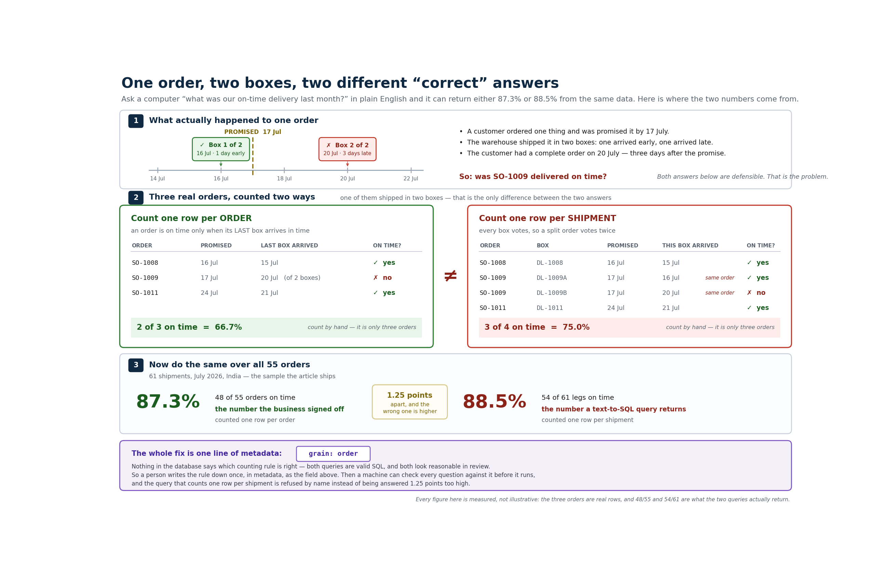

# The Semantic Layer for BI and AI: Making "Just Ask the Data" Trustworthy

*The short version. The full write-up, with the code and all the diagrams, is on Medium. Link at the end.*

---

Two people asked the same database the same question on the same day: "on-time delivery for
India last month." One got 88.5%. The other got 87.3%. One of them is wrong, and nobody in the
meeting could say which.

Nothing was broken. No query failed. Both numbers had real SQL behind them that any engineer
would have signed off on. The only difference was what they counted. One counted orders. The
other counted shipments. A few orders had shipped in two boxes, so counting shipments counted
those orders twice. 55 orders arrived in 61 boxes. The gap was small enough to look like
rounding, and it always made the number look better, so that is the one that reached the slide.

*One order that ships in two boxes can be counted as one order or as two shipments. Count the
shipments and you get 88.5%. Count the orders and you get 87.3%.*

Now put an AI in the middle. The moment people ask questions in plain English and a model writes
the SQL, this stops being a rare slip and becomes the default. The model is not bad at SQL. It is
guessing at the one thing nobody wrote down: what a single row is supposed to mean. You cannot
prompt your way out of that, because the fact that is missing was never in the prompt.

## The fix, in one rule

The AI never writes SQL and never does the math. It picks an approved metric and fills in a small
form: which metric, which filters, which dates. A plain compiler turns that form into SQL. And
seven checks run before any SQL exists at all.

That last part is the whole game. One of those checks notices when a question is asking at the
wrong grain, and it refuses to answer instead of quietly handing back 88.5%. The refusal is the
feature:

> I can't answer that. The metric is defined per order, but the question is asking per shipment,
> and aggregating at the wrong grain changes the number.

"I can't answer that, and here is the rule that stopped me" is something you can put in front of
a CFO. A system that always hands back a number is not.

## The payoff is the harder question

"What was the number?" is the easy question. The one people actually ask is "why did it drop?"

On-time delivery had fallen 8.9 points from the month before, from 96.2% down to 87.3%. The
obvious suspect was logistics. But on the late orders, transportation had actually run faster
than planned on 5 of the 7. Logistics was ahead of schedule. The real cause was quality
inspection, running 4.75 days over a one-day target, with no slack in the schedule to absorb it.

Without a planned baseline for each step, you would get a confident, reasonable, wrong story, and
you would send a team to go fix the wrong problem.

## None of this is magic

It is a handful of small files that write down the things a data crawler can never find for you:
what a row means, which records to leave out, the agreed definition of a metric, and how long
each step is supposed to take. Those are the facts that decide whether an answer is right or just
well-formed. The 88.5% mistake lived in a field no crawler can see, which is why pointing a tool
at your warehouse and switching on "ask the data" gives you a demo, not something you can trust.

If two of your dashboards disagreed by a point tomorrow, who on your team could actually tell you
which one is right? If the answer is "ask Priya," you already have a semantic layer. It just is
not written down yet.

---

**The full write-up** walks through it step by step, with the metadata each step produces, the
seven checks, and a single file you can paste into a terminal and run (no API key, no sign-up):

- Full article on Medium: *[paste your Medium link here once published]*
- Code: [github.com/BeenaKhandelwal/semantic-layer-nl](https://github.com/BeenaKhandelwal/semantic-layer-nl)
