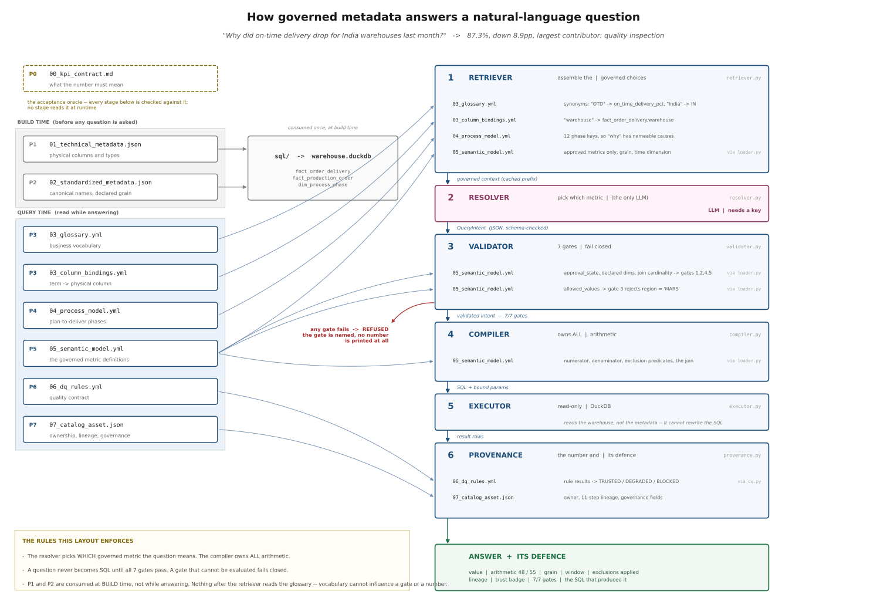
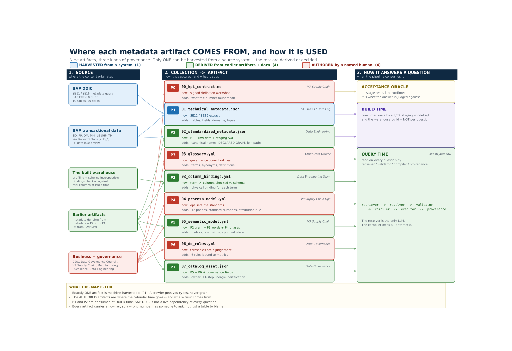

# The Semantic Layer for BI and AI: A Step-by-Step Guide to Trustworthy Natural-Language Analytics

**An implementation guide, with the sample metadata each phase actually produces.**

---

Ask a database a plain question — *"how many customers did we have last month?"* — and it
can hand you two different answers from the same rows. One counts customers; the other
counts orders, so anyone who bought twice is counted twice. Both queries run, both look
reasonable, and the wrong one is always the larger — so it is the one that reaches the
slide. Swap "customers" for any figure your business actually reports and the trap is the
same.

The same bug produced the two numbers this guide is about. Same warehouse, same afternoon,
same question:

> *"On-time delivery for India warehouses last month."*

**88.5%** and **87.3%**.

Same DuckDB file. Same SQL dialect. Same 132 orders. One of them is wrong, and in the
review nobody could say which — which is the actual problem, and it is not a problem
prompt engineering can reach.

Here is where 88.5% comes from. The `deliveries_raw` table has one row per delivery *leg*.
An order that ships in two legs — partial shipment on Tuesday, remainder on Friday — has
two rows. Join orders to legs and count, and that order votes twice. Worse: if the first
leg arrived before the promised date, the order looks on time twice over, while the second
leg that actually blew the promise is one row among 61.

61 legs. 55 orders.

- Order grain: **48 / 55 = 87.27%**
- Delivery grain: **54 / 61 = 88.52%**

The gap is 1.25 points. It is small enough to look like rounding, and it always errs
upward. A wrong number that flatters you is the one that survives to the board deck.

The model did not hallucinate. It wrote syntactically valid, semantically reasonable SQL
against a table whose grain nobody had written down anywhere it could read. **The failure
was in the metadata, so the fix has to be in the metadata.**

---

## The architectural rule

Everything below follows from one decision:

> **The model never writes SQL and never does arithmetic.** It reads a governed metadata
> slice and emits a validated JSON object — which metric, which filters, which time window.
> A deterministic compiler turns that object into SQL.

This is the inversion that matters. Text-to-SQL asks a language model to be right about
grain, joins, exclusions and fiscal calendars on every single call. This architecture asks
it to be right about *one* much easier thing: which of three approved metrics you meant.
Everything that must be exactly right is compiled from metadata, by code, the same way
every time.

Two users asking the same question in different words get the same number, because the
number was never in the model's hands.

The pipeline is six stages:

```
retriever → resolver → validator → compiler → executor → provenance
```

Only the **resolver** calls a model. Only the **compiler** writes SQL. And validation
happens *before* compilation, so a refused question never becomes SQL at all.



*Full resolution: [`docs/diagrams/nl_dataflow.svg`](../docs/diagrams/nl_dataflow.svg) —
scaled to fit a page here, so open it directly to read the edge labels.*

Each arrow is a stage reading a specific artifact for a specific reason. Two rows repay a
second look: **the validator and the compiler never open a file.** Both receive a
`SemanticModel` that the loader parsed, which means the compiler has no access to the
glossary at all. Vocabulary is resolved *before* the gates, so which synonym a user typed
can never reach the arithmetic.

---

## Eight phases, nine artifacts

Each phase produces a real file and closes one specific way natural-language querying
fails. That pairing is the whole method — a phase that doesn't close a named failure is a
phase you can skip.

| Phase | Artifact | The NL failure it closes |
|---|---|---|
| P0 | `00_kpi_contract.md` | Nobody agrees what "on-time" means, so no answer can be wrong |
| P1 | `01_technical_metadata.json` | Column names harvested from SAP DDIC, with no business meaning |
| P2 | `02_standardized_metadata.json` | Types and keys inconsistent across source systems |
| P3 | `03_glossary.yml` + `03_column_bindings.yml` | "OTD", "delivery reliability", "promise adherence" reach no column |
| P4 | `04_process_model.yml` | The model can answer *what* happened, never *why* |
| P5 | `05_semantic_model.yml` | The model invents its own arithmetic — **this is where 88.5% dies** |
| P6 | `06_dq_rules.yml` | A number computed from incomplete inputs is returned with full confidence |
| P7 | `07_catalog_asset.json` | The answer arrives with no provenance, so nobody can defend it |

Nine files, eight phases: P3 emits two, because a glossary term and its physical binding
are different governance objects with different owners.

---

## Where the metadata comes from, and where it goes

The question that lands next — usually from whoever is being asked to fund this — is
*"can't we just harvest all that from SAP?"*



*Full resolution:
[`docs/diagrams/metadata_sources.svg`](../docs/diagrams/metadata_sources.svg) — every box
carries the collection method and the accountable owner, which is worth opening for.*

Read it left to right: **source → how it was collected → the artifact → when the pipeline
consumes it.** The colours are the answer to the funding question.

**One of the nine artifacts is machine-harvestable.** `01_technical_metadata.json` comes
out of the SAP data dictionary via SE11 / SE16 — repeatable, cheap, automatable. The other
eight split two ways:

| Provenance | Count | What it means | Artifacts |
|---|---|---|---|
| **HARVESTED** | 1 | a repeatable query against a running system | P1 |
| **DERIVED** | 4 | computed from earlier artifacts plus the data | P2, P3 bindings, P5, P7 |
| **AUTHORED** | 4 | a named human decided something no system knows | P0, P3 glossary, P4, P6 |

The derived four are cheap to keep current, because their inputs are themselves versioned
artifacts: P2 from P1 plus the raw rows plus staging SQL; the column bindings from the
glossary checked against real warehouse columns at build time; P5 from P2's grain, P3's
vocabulary and P4's phases; P7 from P5 + P6 plus governance fields.

The authored four are where the calendar time goes. Somebody had to decide that "on-time"
means the *current* promised date and not the original (P0), that "OTIF" and "promise
adherence" are sanctioned synonyms for the same metric (P3), that a standard QM usage
decision takes one day (P4), and that 2% missing delivery dates is `degrading` rather than
`blocking` (P6). No amount of crawling produces any of those, and none of them are
discoverable from the data — they are judgements, made by someone accountable for them.

Which is the whole point, stated as a planning fact: **a harvester gets you tables,
fields, domains and types. It cannot get you grain, exclusions, an approved definition or
a standard duration** — and those are precisely the fields that decide whether the answer
is right rather than merely well-formed. The 88.5% error lives in a field no crawler
emits. This is why "point a catalog at the warehouse and turn on NL query" produces a demo
and not a trustworthy system.

### And then how it gets used

The right-hand band is the other half of the question, and it separates three things that
get conflated:

- **P0 is never read at runtime.** It is the acceptance oracle — the thing the answer is
  judged *against*, not an input to producing it. If your KPI contract is being parsed by
  software, it has stopped being a contract.
- **P1 and P2 are consumed once, at build time**, by `sql/02_staging_model.sql` and the
  warehouse build. So the SAP data dictionary is not a live dependency of every question —
  which is both the truth and considerably less alarming than the alternative reading.
- **P3–P7 are read on every question**, by retriever, validator, compiler and provenance
  respectively.

That last line is the one that matters for cost and for failure modes: six artifacts sit in
the hot path of every natural-language question, and if any of them is wrong, every answer
is wrong the same way — silently, consistently, and with a provenance block attached that
makes it look governed.

Both figures are generated from declared graphs, not drawn. Every arrow in the sourcing
map carries a `probe` string that must occur in the artifact it points at, and the two
diagrams are cross-checked against each other, so neither can claim a lineage the files
don't support.

### The synonym layer (P3)

Vocabulary is where NL querying quietly fails, and it is the cheapest phase to build.
From the real file, with two catalog fields dropped:

```yaml
- term: On-Time Delivery %
  definition: >
    Share of eligible customer orders delivered on or before the promised
    delivery date. Measured at order grain (one row per order_id). An order
    counts as delivered only when its final delivery leg arrives. Excludes
    cancelled orders and orders not yet due.
  synonyms: [OTD, on time delivery, on-time delivery, delivery performance,
             delivery reliability, promise adherence, OTIF, on time in full]
  owner: VP Supply Chain
  steward: Supply Chain Analytics Lead
```

Note that the definition states the grain *in prose the model reads*. That sentence — "one
row per order_id" — is doing real work.

### The governed metric (P5)

This is the load-bearing artifact. Abridged from the real file:

```yaml
- name: on_time_delivery_pct
  label: On-Time Delivery %
  entity: fact_order_delivery
  grain: order
  time_dimension: promised_delivery_date
  expression:
    type: ratio_percent
    numerator: sum(CASE WHEN is_on_time THEN 1 ELSE 0 END)
    denominator: sum(CASE WHEN is_eligible THEN 1 ELSE 0 END)
  exclusions:
    - key: cancelled_orders
      predicate: order_status <> 'CANC'
      rationale: A cancelled order was never due; including it inflates the denominator.
    - key: not_yet_due
      predicate: promised_delivery_date <= DATE '2026-08-07'
      rationale: >
        An order promised after the as-of date is not late, it is pending.
  business_rules:
    - Measured against the CURRENT promised date, not the original.
    - Order-grain only. Delivery-grain aggregation double-counts split shipments.
  owner: VP Supply Chain
  approval_state: approved
  lineage: [SAP SD, SAP EWM, SAP TM, fact_order_delivery]
```

Four things to notice, because each one is a defect that would otherwise ship:

1. **`grain: order`** is declared, not inferred. This is the field that kills 88.5%.
2. **Exclusions carry a `rationale`.** Six months on, an exclusion without a stated reason
   gets deleted by someone who assumes it was a mistake.
3. **`approval_state: approved`** is read by the retriever, so an unapproved metric is
   never shown to the model. It cannot be asked for because it was never offered.
4. **Ratios are declared as numerator and denominator**, never as a pre-averaged rate. The
   compiler sums numerators and sums denominators, then divides. Averaging percentages
   across groups of unequal size gives a different, wrong number — and it looks fine.

### The data-quality contract (P6)

Rules bind to specific metrics, so a defect degrades only what it actually touches:

```yaml
- rule_id: dq_completeness_delivery_date
  dimension: completeness
  threshold: 2.0
  comparison: lte
  severity: degrading
  bound_to: [on_time_delivery_pct]
```

A trust badge — `TRUSTED`, `DEGRADED`, `BLOCKED` — ships with every answer. `BLOCKED`
*replaces* the number rather than annotating it, because a caveated wrong number gets
pasted into a slide with the caveat trimmed off.

---

## The seven gates

Between the model's JSON and any SQL, seven checks run. All seven run every time, and a
gate that cannot be evaluated **fails closed**:

| Gate | Refuses |
|---|---|
| `metric_approved` | a metric that isn't approved, or doesn't exist |
| `dimensions_declared` | grouping by something the model invented |
| `filters_bound` | `region = 'MARS'` — a value outside the declared allowed set |
| `grain_matches` | **the 88.5% query. It never becomes SQL.** |
| `no_fanout` | a dimension only reachable through a one-to-many join |
| `time_window_bounded` | an unbounded or inverted date range |
| `exclusions_applied` | a metric whose certified exclusions can't be applied |

A refusal names the gate and the reason. This is the actual output when the 88.5% query
is put through the pipeline:

```
REFUSED  on_time_delivery_pct: the intent did not pass validation.

  gates failed  grain_matches
  grain_matches        Metric 'on_time_delivery_pct' is certified at grain 'order'; the
                       intent asks for grain 'delivery'. Aggregating at the wrong grain
                       changes the number.

  No number is shown. A value that failed a gate is not a caveated answer,
  it is an unverified one.
```

That is more useful than a number. "I can't answer that, and here is which rule stopped
me" is a system you can put in front of a CFO. One that always produces a number is not.

Note `filters_bound` in particular. Without a declared allowed-value set, a filter on a
misspelled region returns zero rows — and zero rows gets presented as an answer.

---

## The question BI tools can't take

Descriptive questions ("what was it?") only need a glossary, a grain and a metric. The
question people actually ask is diagnostic:

> *"Why did on-time delivery drop for India warehouses last month?"*

That requires per-phase timestamps, per-phase planned baselines, and an attribution rule
**defined once, in metadata**. This is why the manufacturing process is in scope: the
answer to "why" lives upstream in production, not in the delivery table.

The process model declares twelve phases across SAP SD, PP, QM, MM/EWM, LE and TM — demand
capture, MRP, production order release, material staging, production execution, quality
inspection, goods receipt, picking, dispatch, transportation, delivery confirmation,
billing. Nine of them are attributable spans. The other three aren't, and declaring them
would let a filter pass every gate and return zero rows dressed as an answer.

For each order and phase: `variance_days = actual_duration − standard_duration`. The
attribution is one `argmax` over the nine spans, ties broken to the earliest phase,
evaluated only for orders that actually missed.

The real output, with the answer block's metadata lines elided:

```
ANSWER   On-Time Delivery % is 87.3% -- 48 of 55 eligible orders delivered on or
         before the promised date

  ...   (metric, arithmetic, grain, window, filters, exclusions, lineage, trust, gates)

  BREAKDOWN
    Quality inspection           4
    Transportation               2
    Production execution         1
    unattributed                 0

  Largest contributor: Quality inspection (4 of 7 late orders).

  COMPARISON
    prior window               June 2026 (2026-06-01 to 2026-06-30) on promised_delivery_date
    prior value                96.2% (25 / 26)
    change                     down 8.9pp (96.2% -> 87.3%)
```

`unattributed 0` is printed even though it is zero, on purpose: an attribution that
silently drops the orders it could not explain is an attribution you cannot audit.

On those 4 orders, the QM usage decision ran an average of **4.75 days over its 1.0-day
standard, against 0.0 days of available slack** — the promise date left no room to absorb
it. Plant 1010.

And the part that makes the case: **transportation ran *under* standard on 5 of the 7 late
orders.** Logistics was the obvious suspect and logistics was faster than planned. Without
per-phase baselines you get a plausible, confident, wrong story — and you go optimize the
wrong department.

---

## What this does *not* do

Worth stating plainly, because governance metadata invites overreading.

Catalog metadata supports **discovery**. It is not policy enforcement, consent management,
access control, or retention automation. An `owner` field records who is accountable; it
does not stop anyone from querying anything. Those are separate systems, and a semantic
layer that implies otherwise is worse than one that stays silent.

Also honestly scoped: one fact table with declared joins, not a general warehouse; a
frozen as-of date so the numbers are reproducible; a single-node engine. And the live
resolver path is documented but **not** asserted as tested here — it needs API credentials
this environment doesn't have, and the verification script reports that criterion as
`SKIP` rather than quietly counting it as a pass.

---

## Reproducing it

Everything above is measured, not illustrative. Five commands, no API key, no network:

```bash
pip install -r requirements.txt
python src/build_warehouse.py
python src/ask.py --offline Q1     # 87.3%, 48/55, TRUSTED, 7/7 gates
python src/ask.py --offline Q2     # the diagnostic breakdown above
python verify_acceptance.py        # measures every acceptance criterion
```

401 tests hold it in place, and the guide's prose is under test alongside the code — every
figure in it is asserted against the artifacts or the warehouse, because a reproduction
guide whose numbers have drifted spends the reader's trust before it spends their time.

If you would rather not clone anything: the companion **Medium post** carries the whole
thing as a single self-contained file — embedded data, inline metadata, all seven gates,
the compiler and the diagnostic — that runs on `pip install duckdb pyyaml` and reproduces
every number above. It is the same file this repository tests, byte for byte.

---

## The one-line version

Natural-language querying does not fail because models can't write SQL. It fails because
the metadata that makes a question answerable *correctly* — grain, cardinality, exclusions,
approved definitions, process baselines — was never written down where anything could read
it.

Build that, and the model's job shrinks to something it is genuinely good at.

**What is your team's answer to "which of these two numbers is right"? If it's "ask
Priya," you have a semantic layer — it just isn't written down.**
